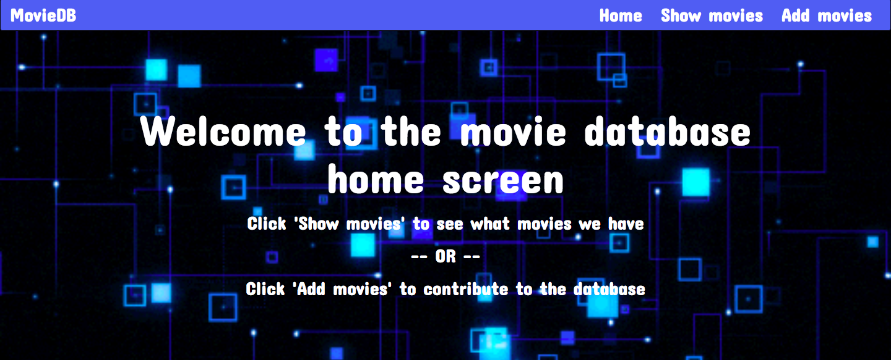
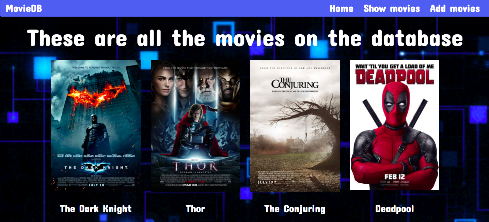
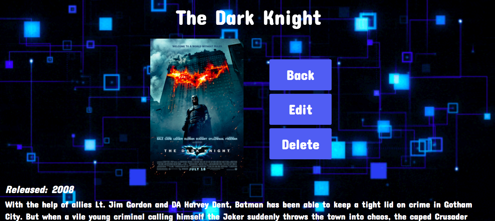
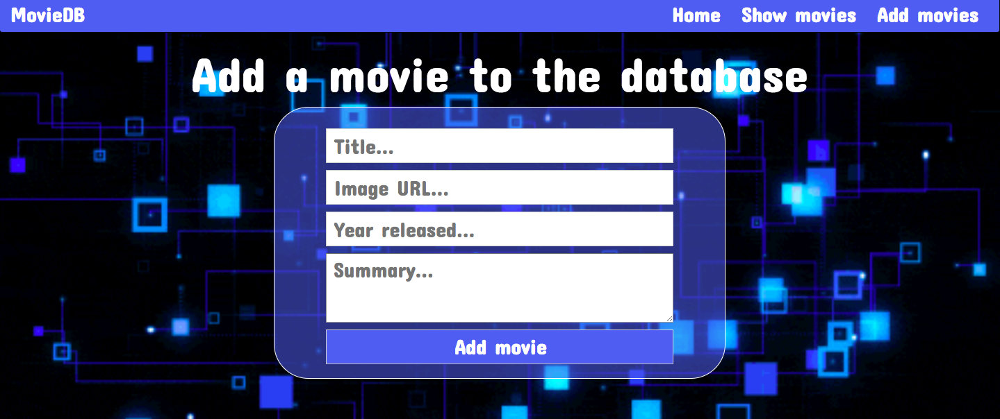
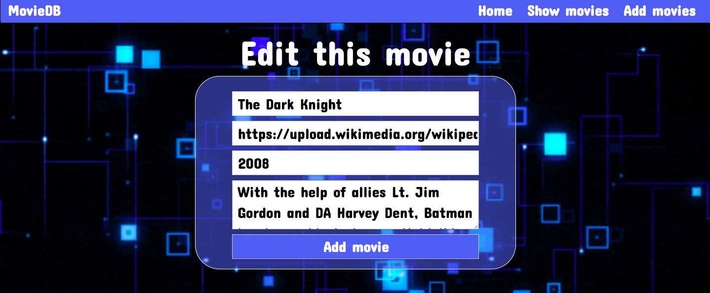

# Full stack web app

## Requirements
- [x] Create a full stack web application using Ruby, Sinatra, Rack and Postgres
- [x] Must be a different resource to any previous resource that was used before
- [x] Must use Postgres to store, display and manipulate data; performing all necessary CRUD actions
- [x] Must use the 7 RESTful routes
- [x] Must create dynamic web pages using ERB
- [x] Must explore and use Static Assets such as CSS to make it look presentable.
BONUS
- [x] Can use jQuery or Javascript in some way throughout the app

## Result

### Home screen

This screen introduces the website, giving simple instructions on how to navigate around the page and what to expect when the user gets to a certain page.

### Show all screen

This screen shows all of the movies on the website to the user. Allowing them to click on either the image or the title, the user can freely navigate around each record.

### Show one screen

This screen gives more information on what the user has clicked. It will show the movie poster, the title, the year it was released and a brief summary on the movie. It will also present the user with 3 options:
- To go back to all the records
- Edit the film that they are looking at
- Delete the film from the database and from the website

### Add a movie screen

This screen presents the user with a form, and prompts the user to enter the correct information within their respective fields. This will then post the results to the Database and will be dealt with accordingly.

### Edit a movie screen

This screen also present the user with a form. However, this form is filled in with information that is already within the database of that record. It allows the user to change what needs to be changed and then save it to the database afterwards.

